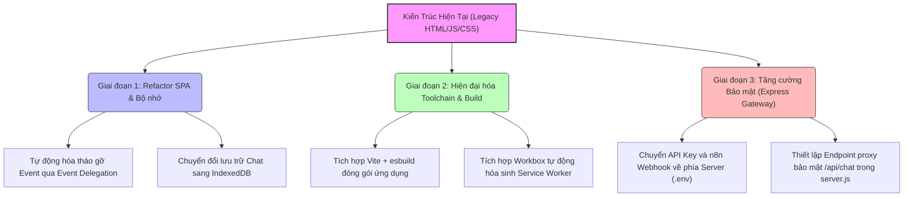

# 📊 BÁO CÁO KIỂM TOÁN KỸ THUẬT & ĐỀ XUẤT TỐI ƯU HOÁ DỰ ÁN MEDSTAND

Tôi đã thực hiện quét toàn bộ cấu trúc mã nguồn của dự án **Medstand** (bao gồm SPA Routing, HTTP Service, Service Worker PWA, Chatbot Widget và database metadata). Dưới đây là các phân tích kỹ thuật chuyên sâu về các khu vực có nguy cơ lỗi cao và các đề xuất nâng cấp giúp hệ thống hoạt động ổn định, bảo mật và đạt hiệu năng tối ưu nhất.

---

## 🔍 PHẦN 1: CÁC KHU VỰC CẦN TỐI ƯU HÓA (ISSUE AUDIT)

### 1. Kiến trúc SPA & Nguy cơ Rò rỉ Bộ nhớ (Memory Leak & Event Duplication)
*   **Phân tích thực trạng:**
    Trong file [router.js](file:///c:/Git%20cua%20tui/Medstand/src/js/core/router.js#L303-L305), bộ định tuyến SPA thực hiện gỡ bỏ và nạp lại thẻ `<script>` mỗi lần người dùng chuyển trang. Tuy nhiên, bản chất của JavaScript là **không tự động giải phóng** các hàm toàn cục, biến toàn cục hoặc sự kiện được liên kết qua `$(document).on()` khi thẻ `<script>` bị xóa khỏi DOM.
*   **Hệ quả:**
    *   Nếu nhà phát triển quên đăng ký hàm dọn dẹp trong `_pageCleanupHooks` khi viết trang mới, các sự kiện click sẽ bị nhân đôi mỗi lần chuyển trang. Ví dụ: Nếu người dùng chuyển qua lại giữa Trang chủ và Tạo đơn 5 lần, nút bấm "TẠO ĐƠN HÀNG" sẽ bị kích hoạt **5 lần cùng lúc** khi click, dẫn đến gửi trùng đơn hàng và spam API.
    *   Tăng dung lượng tiêu thụ RAM của trình duyệt theo thời gian, gây chậm giật ứng dụng trên điện thoại cấu hình yếu.
*   **Đề xuất giải pháp:**
    *   **Áp dụng Event Delegation thông minh:** Hạn chế sử dụng `$(document).on(...)`. Hãy gán sự kiện trực tiếp vào các phần tử nằm trong `#app-content` (ví dụ: `$('#app-content').on('click', '#btnSubmit', ...)`). Khi Router ghi đè `innerHTML` của `#app-content`, các sự kiện này sẽ tự động được trình duyệt giải phóng hoàn toàn khỏi bộ nhớ mà không cần viết hàm dọn dẹp thủ công.
    *   Gói logic trang vào cấu trúc Class/Controller có hàm `.init()` và `.destroy()` rõ ràng.

---

### 2. Hiệu năng tải trang đầu tiên (Bundling & HTTP Requests)
*   **Phân tích thực trạng:**
    File [index.html](file:///c:/Git%20cua%20tui/Medstand/index.html) hiện đang nạp trực tiếp hơn **25 tệp tin CSS/JS** riêng lẻ thông qua các thẻ `<script>` và `<link>`.
*   **Hệ quả:**
    Khi người dùng (đặc biệt là các Trình dược viên - TDV đi tuyến ngoài thị trường) mở ứng dụng trên mạng di động 3G/4G không ổn định, trình duyệt phải thực hiện hơn 25 kết nối HTTP roundtrip riêng lẻ để tải app. Điều này làm tăng thời gian "màn hình trắng" khi khởi động ứng dụng lên từ 4-6 giây.
*   **Đề xuất giải pháp:**
    Nâng cấp dự án sang sử dụng công cụ đóng gói **Vite + esbuild**. Công cụ này sẽ tự động:
    *   Nén (Minify) toàn bộ mã nguồn để giảm 70% dung lượng tải.
    *   Gộp toàn bộ 25+ file JS/CSS thành **1 hoặc 2 file duy nhất** giúp ứng dụng khởi động tức thì trong < 1 giây.
    *   Tự động chạy cơ chế làm rối mã nguồn (Obfuscate) khi đóng gói để bảo mật hoàn toàn thuật toán lõi.

---

### 3. Giới hạn dung lượng lưu trữ của Chatbot (Storage Quota Limits)
*   **Phân tích thực trạng:**
    Trong [chatbot.js](file:///c:/Git%20cua%20tui/Medstand/chatbot-widget/js/chatbot.js#L149), lịch sử hội thoại của trợ lý AI được lưu trữ trong `localStorage`.
*   **Hệ quả:**
    *   `localStorage` có giới hạn cứng rất nghiêm ngặt của trình duyệt là **5MB**. Do Chatbot của Medstand hiển thị rất nhiều dữ liệu nặng dạng thẻ (Card), bảng dữ liệu (Table HTML), và phản hồi chi tiết từ n8n, bộ nhớ 5MB này sẽ nhanh chóng bị tràn chỉ sau một vài tuần sử dụng thường xuyên.
    *   Khi bị tràn, trình duyệt sẽ quăng lỗi `QuotaExceededError` và làm sập ứng dụng Chatbot.
*   **Đề xuất giải pháp:**
    Chuyển đổi công nghệ lưu trữ lịch sử chat từ `localStorage` sang **IndexedDB** (sử dụng các thư viện siêu nhẹ như `localForage` hoặc `idb`). IndexedDB hỗ trợ lưu trữ **không giới hạn dung lượng** (lên tới hàng trăm MB hoặc GB) trên thiết bị di động, đảm bảo lưu trữ hàng ngàn hội thoại tuyệt đối an toàn.

---

### 4. Quản lý Offline và Cache trong Service Worker (`sw.js`)
*   **Phân tích thực trạng:**
    Mảng `PRECACHE_URLS` trong [sw.js](file:///c:/Git%20cua%20tui/Medstand/sw.js#L10) hiện đang khai báo thủ công danh sách đường dẫn tĩnh. Khi có thay đổi file CSS/JS, nhà phát triển buộc phải nhớ vào thay đổi hằng số `CACHE_VERSION`.
*   **Hệ quả:**
    *   Nếu sửa file JS mà quên tăng `CACHE_VERSION`, thiết bị của người dùng sẽ tiếp tục sử dụng code cũ nằm trong cache, dẫn đến không nhận được tính năng mới hoặc sinh ra lỗi không khớp giao diện.
    *   Rất khó quản lý khi dự án ngày một lớn lên với hàng trăm file.
*   **Đề xuất giải pháp:**
    Sử dụng thư viện **Workbox (Webpack/Vite plugin)** để tự động hóa quá trình sinh Service Worker. Công cụ này sẽ quét toàn bộ thư mục dự án và tự động tạo mã hash (dấu vân tay dữ liệu) cho từng file. Khi file thay đổi, Service Worker sẽ tự động biết để cập nhật file đó mà bạn không cần phải đụng tay vào file cấu hình `sw.js` nữa.

---

### 5. An toàn bảo mật API Key và Endpoint n8n (Security Gateway)
*   **Phân tích thực trạng:**
    Địa chỉ URL thực tế của hệ thống n8n (`N8N_BASE`) và các API Key được phơi bày công khai ngay tại tệp cấu hình trình duyệt [env.js](file:///c:/Git%20cua%20tui/Medstand/env.js#L12).
*   **Hệ quả:**
    Bất kỳ người dùng nào mở F12 đều có thể lấy được địa chỉ n8n Webhook và API Key. Kẻ xấu có thể sử dụng thông tin này để gửi spam hàng triệu request phá hoại hoặc khai thác dữ liệu nội bộ của doanh nghiệp thông qua cổng n8n.
*   **Đề xuất giải pháp:**
    *   **Thiết lập API Gateway:** Sử dụng Express Server của bạn ([server.js](file:///c:/Git%20cua%20tui/Medstand/server.js)) làm cầu nối bảo mật.
    *   Thay vì gọi trực tiếp từ trình duyệt tới n8n Cloudflare, Frontend chỉ gửi request tới cổng phụ `/api/chat` trên server Node.js của bạn. 
    *   Server Node.js sẽ làm nhiệm vụ xác thực phiên đăng nhập (JWT token), kiểm tra chống spam (Rate Limiting) rồi mới dùng API Key (được lưu an toàn trong file `.env` phía server) để gọi ngầm tới n8n. Cơ chế này giấu hoàn toàn hạ tầng n8n khỏi mắt người dùng!

---
---

## 🚀 PHẦN 2: LỘ TRÌNH ĐỀ XUẤT PHÁT TRIỂN TIẾP THEO (ROADMAP)

Dưới đây là sơ đồ lộ trình nâng cấp kiến trúc hệ thống Medstand đề xuất thực hiện:

