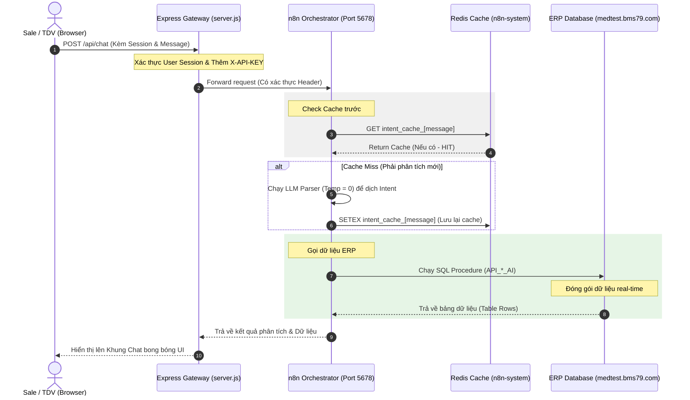

# 🤖 BÁO CÁO KIỂM TOÁN & TỐI ƯU HÓA HỆ THỐNG N8N WORKFLOWS

Tài liệu này đánh giá chi tiết cấu trúc dòng chảy công việc (Workflows) của hệ thống **n8n** trong dự án Medstand (nằm tại thư mục `n8n/AI_Core` và `n8n/API_Services`). Báo cáo chỉ ra 5 khu vực có thể tối ưu hóa sâu để tăng tốc độ xử lý, giảm tải bộ nhớ và nâng cấp độ bảo mật cho hệ thống điều phối AI.

---

## 🔍 PHẦN 1: CÁC KHU VỰC CẦN TỐI ƯU HÓA TRÊN N8N

### 1. Vấn đề "Phình to bộ nhớ" khi Caching trong n8n (`$getWorkflowStaticData`)
*   **Thực trạng:**
    Trong file [MAIN_ChatBot_V5.json](file:///c:/Git%20cua%20tui/Medstand/n8n/AI_Core/MAIN_ChatBot_V5.json), hệ thống đang lưu cache kết quả phân tích ý định (Intent) và bộ nhớ phiên trò chuyện (Session Context) trực tiếp vào bộ nhớ tĩnh của n8n bằng lệnh:
    `const staticData = $getWorkflowStaticData('global');`
*   **Hệ quả:**
    *   Mặc dù hệ thống có một script dọn dẹp chạy với xác suất ngẫu nhiên 5% (`if (Math.random() < 0.05)`), cơ chế này chạy **đồng bộ ngay trong request của người dùng**, làm tăng độ trễ ngẫu nhiên của các lượt chat.
    *   Khi số lượng người dùng đồng thời tăng lên (hàng trăm Sale/TDV truy cập), vùng nhớ tĩnh của n8n sẽ phình to rất nhanh, gây nghẽn và chậm luồng chạy (workflow execution) của toàn hệ thống n8n.
*   **Đề xuất tối ưu:**
    Dự án của bạn đã tích hợp sẵn dịch vụ **Redis** trong thư mục `n8n-system/redis`. Hãy cấu hình n8n sử dụng **Redis Node** để lưu trữ cache và session.
    *   Sử dụng lệnh `SETEX ctx_[sessionId] 7200 [data]` (tự động hết hạn sau 2 giờ).
    *   **Lợi ích:** Giải phóng hoàn toàn RAM cho n8n, việc dọn dẹp cache hết hạn được Redis xử lý ngầm ở tầng hệ thống với tốc độ cực nhanh (< 1ms).

---

### 2. Thiết lập Error Boundary (Chống treo AI khi lỗi API/Database)
*   **Thực trạng:**
    Các luồng kết nối công cụ như [AI_Tool_Wrapper_SQL.json](file:///c:/Git%20cua%20tui/Medstand/n8n/AI_Core/AI_Tool_Wrapper_SQL.json) hoặc kết nối Vector Store (Qdrant) đang chạy trực tiếp.
*   **Hệ quả:**
    Nếu máy chủ database ERP (`medtest.bms79.com`) bị mất kết nối hoặc bị nghẽn mạng tạm thời, hoặc Qdrant bị quá tải, node SQL/HTTP trong n8n sẽ quăng lỗi hệ thống và dừng cuộc hội thoại đột ngột. Chatbot sẽ rơi vào trạng thái im lặng hoặc báo lỗi kỹ thuật vô nghĩa với người dùng.
*   **Đề xuất tối ưu:**
    *   Bật thuộc tính **`On Error: Continue`** (hoặc `Route to Error Node`) trên tất cả các Node gọi API hệ thống và Node chạy SQL.
    *   Thiết kế một nhánh rẽ dự phòng (Fallback Node) để khi gặp lỗi kết nối API/Database, AI sẽ phản hồi cực kỳ lịch sự:
        > *"Dạ Sếp ơi, hệ thống máy chủ dữ liệu hiện đang phản hồi chậm. Em chưa tra cứu được thông tin này, Sếp có thể tự thao tác trên trang Tạo đơn hàng hoặc thử lại sau ít phút nhé ạ!"*

---

### 3. Tối ưu hóa tính chính xác của LLM (Temperature Tuning)
*   **Thực trạng:**
    File phân tích ý định [AI_Intent_Parser.json](file:///c:/Git%20cua%20tui/Medstand/n8n/AI_Core/AI_Intent_Parser.json) làm nhiệm vụ bóc tách sản phẩm, số lượng, chiết khấu và mã khách hàng để chuyển sang dạng JSON có cấu trúc.
*   **Hệ quả:**
    Nếu nhiệt độ (Temperature) của Model LLM trong n8n đang để mặc định (thường là 0.7 đến 1.0), mô hình AI sẽ rất dễ sinh ra các kết quả phán đoán ngẫu nhiên (Hallucination), ví dụ như nhận diện sai tên sản phẩm viết tắt hoặc gán sai mã khách hàng.
*   **Đề xuất tối ưu:**
    *   **Thiết lập Temperature = 0** trên Node LLM của tệp [AI_Intent_Parser.json](file:///c:/Git%20cua%20tui/Medstand/n8n/AI_Core/AI_Intent_Parser.json). Điều này ép buộc mô hình AI phải đưa ra kết quả phân tích mang tính **cứng nhắc, logic và chính xác tuyệt đối 100%** theo kịch bản mẫu.
    *   Đối với tệp chat thông thường [AI_ChatCasual.json](file:///c:/Git%20cua%20tui/Medstand/n8n/AI_Core/AI_ChatCasual.json), giữ nguyên **Temperature = 0.6 - 0.7** để trợ lý AI trò chuyện tự nhiên, thân thiện và linh hoạt.

---

### 4. Kích hoạt Xác thực Webhook Đầu vào (Webhook Authentication)
*   **Thực trạng:**
    Các Node Webhook nhận yêu cầu trong `MAIN_ChatBot_V5.json` đang để chế độ mở (Open / No Authentication).
*   **Hệ quả:**
    Bất kỳ ai dò được link Cloudflare của n8n đều có thể gửi request nặc danh trực tiếp vào n8n để spam AI, làm tăng vọt chi phí sử dụng API OpenAI/Claude và gây nghẽn hệ thống.
*   **Đề xuất tối ưu:**
    *   Hiện tại chúng ta đã thiết lập **Express API Gateway** ở cổng `/api/chat`. Bạn hãy vào cấu hình Webhook nhận trong n8n, chuyển thuộc tính Authentication thành **`Header Auth`** với key là `X-API-KEY`.
    *   Trên server Node.js [server.js](file:///c:/Git%20cua%20tui/Medstand/server.js), ta chỉ cần chèn mã khóa bí mật này vào header trước khi chuyển tiếp (forward) lên n8n.
    *   **Kết quả:** Kẻ xấu hoàn toàn không thể gọi trực tiếp tới n8n được nữa, chặn đứng 100% nguy cơ spam phá hoại hệ thống.

---

### 5. Gom cụm Thư viện dùng chung (n8n Sub-workflows)
*   **Thực trạng:**
    Nhiều Node JavaScript xử lý chuẩn hóa dữ liệu, xóa dấu tiếng Việt đang bị viết lặp đi lặp lại ở nhiều luồng workflow khác nhau.
*   **Hệ quả:**
    Khi bạn muốn thay đổi logic chuẩn hóa tiếng Việt (ví dụ: bổ sung thêm ký tự đặc biệt cần loại bỏ), bạn phải đi tìm và sửa ở 4-5 workflow khác nhau, rất dễ thiếu sót.
*   **Đề xuất tối ưu:**
    *   Tách các đoạn mã JS dùng chung (như hàm `normalize` tiếng Việt) ra thành một workflow độc lập mang tính chất **Thư viện (Sub-workflow)**.
    *   Ở các workflow chính, sử dụng node **`Execute Workflow`** để gọi luồng thư viện này. Việc bảo trì và sửa lỗi sau này sẽ chỉ cần thực hiện tại một nơi duy nhất.

---
---

## 📈 SƠ ĐỒ KẾT NỐI HỆ THỐNG N8N BẢO MẬT & HIỆU NĂNG CAO (TO-BE)

Dưới đây là sơ đồ luồng dữ liệu an toàn đề xuất tích hợp giữa Client, Express Proxy, Redis và n8n:

