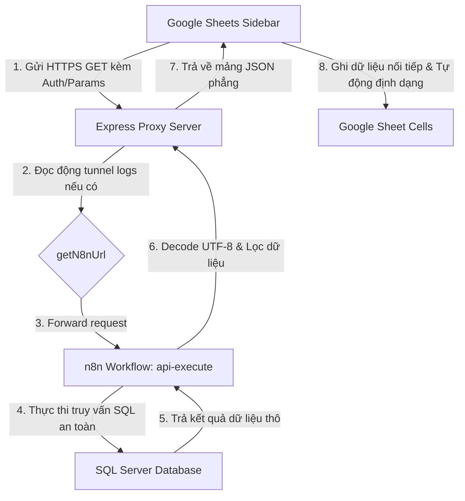

# TÀI LIỆU ĐẶC TẢ KỸ THUẬT & CẤU HÌNH HỆ THỐNG
## GOOGLE SHEETS DYNAMIC SYNC PANEL — WHITE-LABEL MODEL

Tài liệu này mô tả chi tiết kiến trúc hệ thống, luồng truyền tải dữ liệu, cơ chế tự phục hồi kết nối (Self-Healing) và hướng dẫn cấu hình chi tiết cho giải pháp **Đồng bộ nối tiếp dữ liệu lên Google Sheets**.

---

## 1. KIẾN TRÚC TỔNG QUAN (SYSTEM ARCHITECTURE)

Hệ thống hoạt động theo mô hình **White-Label** (Nhãn trắng), cho phép đóng gói toàn bộ logic phía Client (Google Sheets) thành một Add-on độc lập. Client kết nối động tới bất kỳ máy chủ phân phối dữ liệu nào của khách hàng thông qua giao thức HTTPS bảo mật.

### Sơ đồ luồng truyền tải dữ liệu (Data Flow):



---

## 2. THÔNG SỐ ĐẶC TẢ API GATEWAY (API SPECIFICATION)

Đường dẫn chịu trách nhiệm tiếp nhận và tiền xử lý dữ liệu cho Google Sheets được định nghĩa tại file `server.js`:

*   **Endpoint URL**: `/api/sheet-data`
*   **Giao thức (Method)**: `GET`
*   **Kiểu dữ liệu phản hồi**: `application/json` (Định dạng phẳng: Mảng chứa các đối tượng - Flat Array of Objects).

### Các tham số truy vấn (Query Parameters):

| Tham số | Kiểu dữ liệu | Bắt buộc | Mô tả |
| :--- | :--- | :--- | :--- |
| `ApiCode` | `String` | **Có** | Mã API đã đăng ký trong hệ thống (Ví dụ: `@doanh_so`, `@don_hang`, `@danh_muc`) |
| `apiKey` | `String` | **Có** | Khóa bảo mật xác thực cổng API (khớp với `CHAT_API_KEY` trong `.env`) |
| `Username` | `String` | **Có** | Tên tài khoản thực thi để phân quyền dữ liệu (Row-Level Security) |
| `LoaiBaoCao` | `String` | Tùy chọn | Loại báo cáo chi tiết (Đối với doanh số: `KhachHang`/`SanPham`/`TatCa`) |
| `TuNgay` | `String` | Tùy chọn | Khoảng ngày bắt đầu dữ liệu (Định dạng: `YYYY-MM-DD`) |
| `DenNgay` | `String` | Tùy chọn | Khoảng ngày kết thúc dữ liệu (Định dạng: `YYYY-MM-DD`) |
| `TopN` | `Integer` | Tùy chọn | Giới hạn số lượng kết quả trả về tối đa (Mặc định: `100`) |

---

## 3. CƠ CHẾ TỰ PHỤC HỒI ĐƯỜNG HẦM KẾT NỐI (SELF-HEALING TUNNEL)

Do hệ thống local sử dụng đường hầm bảo mật tạm thời **Cloudflare trycloudflare.com** (tự động thay đổi địa chỉ ngẫu nhiên mỗi khi n8n khởi động lại), Server Proxy tích hợp thuật toán tự động dò tìm địa chỉ thông minh thông qua hàm `getN8nUrl()`:

```javascript
const getN8nUrl = () => {
    let url = process.env.N8N_BASE;
    
    // Bước 1: Quét trực tiếp file .env mới nhất
    const envPath = path.join(__dirname, '.env');
    if (fs.existsSync(envPath)) {
        try {
            const envContent = fs.readFileSync(envPath, 'utf-8');
            const match = envContent.match(/^N8N_BASE\s*=\s*(https:\/\/[^\s#]+)/m);
            if (match) url = match[1].trim();
        } catch (e) {}
    }
    
    // Bước 2: Quét trực tiếp file log hoạt động của Cloudflare Tunnel
    const cfLogPath = path.join(__dirname, 'n8n-system', '.logs', 'cf_tunnel.log');
    if (fs.existsSync(cfLogPath)) {
        try {
            const logContent = fs.readFileSync(cfLogPath, 'utf-8');
            const match = logContent.match(/https:\/\/[a-zA-Z0-9-]+\.trycloudflare\.com/);
            if (match) url = match[0];
        } catch (e) {}
    }
    return url || 'https://realized-comfortable-oxygen-played.trycloudflare.com';
};
```

**Lợi ích**: Express Server không bao giờ bị mất kết nối tới n8n và loại bỏ hoàn toàn việc phải khởi động lại Server thủ công khi n8n thay đổi địa chỉ IP/Tunnel.

---

## 4. CƠ CHẾ VẬN HÀNH PHÍA CLIENT (GOOGLE SHEETS APPS SCRIPT)

Client chạy trên hạ tầng đám mây của Google, giao tiếp với Server qua 2 tệp chương trình:

### 4.1 Quản lý trạng thái và Bộ nhớ cấu hình (`PropertiesService`)
Thay vì lưu trữ thông tin nhạy cảm vào các biến cục bộ, hệ thống sử dụng **`PropertiesService.getUserProperties()`** của Google để lưu trữ cấu hình cổng API bảo mật theo từng người dùng:
*   `sync_domain`: Lưu địa chỉ máy chủ API mà khách hàng khai báo.
*   `sync_apikey`: Lưu khóa bảo mật xác thực API.
*   `sync_username`: Lưu lịch sử tài khoản đăng nhập.

Cấu hình này sẽ tự động điền sẵn (Auto-fill) ở các lần mở tiếp theo để tăng trải nghiệm người dùng.

### 4.2 Thuật toán chèn nối tiếp và Tự động định dạng (Append & Format)
Khi người dùng nhấn **Đồng bộ nối tiếp**, Apps Script thực hiện các bước tự động sau:
1.  **Dò tìm dòng cuối cùng**: Xác định chỉ số dòng cuối cùng hiện có dữ liệu qua `sheet.getLastRow()`.
2.  **Tạo dòng phân cách**: Nếu bảng tính đã có dữ liệu cũ (`lastRow > 0`), tự động chèn **2 dòng trống** để tạo khoảng cách trực quan giữa các đợt đồng bộ.
3.  **Chèn tiêu đề cột (Headers)**: Luôn chèn dòng tiêu đề ở đầu mỗi lô dữ liệu mới nhằm hỗ trợ việc thay đổi loại báo cáo linh hoạt.
4.  **Đổ dữ liệu**: Đổ toàn bộ mảng dữ liệu mới xuống từ dòng kế tiếp dòng cuối.
5.  **Định dạng thẩm mỹ tự động**:
    *   Tô màu nền tiêu đề màu xám Slate đậm (`#334155`), đổi chữ sang màu trắng in đậm, căn giữa.
    *   Tự động kẻ viền mỏng màu xám nhạt (`#cbd5e1`) cho toàn bộ khối dữ liệu mới chèn để đảm bảo sự ngay ngắn.
6.  **Tự động co giãn cột (Auto-Fit Column Widths)**: Gọi hàm `sheet.autoResizeColumns(1, keys.length)` để tự động co giãn độ rộng tất cả các cột vừa khít với nội dung chữ dài nhất, chống hiện tượng khuất chữ hoặc dư thừa khoảng trống cột.

---

## 5. HƯỚNG DẪN CẤU HÌNH TRIỂN KHAI

### Phía Server:
1.  Đảm bảo cổng `3000` của Express Server được kích hoạt qua lệnh `start_server.bat`.
2.  Để Client kết nối được, máy chủ (hoặc cổng 3000 của máy local) phải được expose ra Internet thông qua các giải pháp Tunnel (như Cloudflare Tunnel, ngrok, localtunnel) hoặc cấu hình NAT/Domain thật.
3.  Biến môi trường `CHAT_API_KEY` trong tệp cấu hình `.env` chính là khóa bảo mật để điền vào ô cấu hình khóa trên giao diện Google Sheets.

### Phía Google Sheets:
Khách hàng chỉ cần tạo 2 file `Code.gs` và `Sidebar.html` trong trình soạn thảo Apps Script, dán mã nguồn chuẩn hóa được cung cấp trong thư mục này và chạy hệ thống hoàn toàn độc lập.
