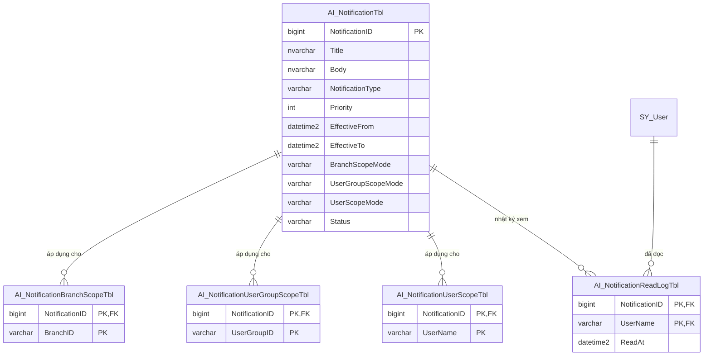

# Báo Cáo Kỹ Thuật & Phương Án Triển Khai: NOTI-001 — Phân Phối Thông Báo Đúng Người Nhận

- **Mã task:** `NOTI-001`
- **Mức độ ưu tiên:** `P1`
- **Trạng thái:** `PLANNING / TODO`
- **Ngày lập:** `14/08/2026`
- **Tài liệu tham chiếu:** [BACKLOG_TASK_PHAT_TRIEN_MEDSTAND_AI_2026-07-27.md](BACKLOG_TASK_PHAT_TRIEN_MEDSTAND_AI_2026-07-27.md)

---

## 1. Mục Tiêu & Yêu Cầu Nghiệp Vụ

### 1.1. Yêu cầu cốt lõi
- **Lọc theo Chi nhánh (`BranchID`)**: Gửi thông báo cho toàn quốc hoặc chỉ định tập hợp các chi nhánh cụ thể (Miền Bắc, Miền Nam, Đà Nẵng,...).
- **Lọc theo Nhóm sale / Vai trò (`UserGroupID`)**: Gửi thông báo cho tất cả nhóm hoặc chỉ định nhóm đối tượng (Trình dược viên `TDV`, Quản lý `QL`, `OTC`, `ETC`,...).
- **Lọc theo Tài khoản cụ thể (`UserName`)**: Hỗ trợ gửi thông báo đích danh tới danh sách tài khoản được chỉ định.
- **Thời gian áp dụng (`EffectiveFrom` - `EffectiveTo`)**: Tự động hiển thị khi đến giờ và tự động ẩn khi hết hạn mà không cần xóa dữ liệu.
- **Theo dõi trạng thái đã xem cá nhân hóa (`isView`)**: Thông báo gửi chung cho một nhóm nhưng việc User A xem không làm ảnh hưởng trạng thái chưa đọc của User B.
- **Hiển thị tối đa trên màn hình**:
  - Popup Modal toàn màn hình khi có thông báo khẩn/quan trọng vừa phát hành.
  - Dải thông báo nổi bật (Banner) trên trang chủ Dashboard.
  - Phóng to xem trọn vẹn văn bản khi click vào từng thông báo trong danh sách.
- **Web Push Notification trên di động**: Nhận thông báo rung chuông và sáng màn hình khóa/màn hình chờ trên điện thoại kể cả khi tắt trình duyệt.

---

## 2. Kết Quả Rà Soát Hệ Thống Hiện Tại

```
┌─────────────────────────────────────────────────────────────────────────────────┐
│                              MEDSTAND ARCHITECTURE                              │
├───────────────────┬───────────────────┬───────────────────┬─────────────────────┤
│ 1. Frontend Web   │ 2. Gateway Proxy  │ 3. AI / n8n       │ 4. Database (SQL)   │
│ (notifications.js)│ (server.js)       │ (MAIN_ChatBot_V5) │ (Shadow Layer)      │
├───────────────────┼───────────────────┼───────────────────┼─────────────────────┤
│ • Đã có UI list   │ • Đã có gateway   │ • Đã có ApiCode   │ ⚠️ CHƯA CÓ SCHEMA:  │
│ • Đã có chuông    │   bảo mật         │   @thong_bao      │ • Thiếu bảng Shadow │
│ • Đã có PWA (sw)  │ • Xác thực cookie │ • Intent NLP      │ • Thiếu lọc ma trận │
│ • Cần thêm popup  │   tránh giả mạo   │   NOTIFICATIONS   │ • Thiếu log đã đọc  │
└───────────────────┴───────────────────┴───────────────────┴─────────────────────┘
```

1. **Frontend Web** ([src/js/pages/notifications.js](file:///c:/Users/Legion/Desktop/AI%20Nh%C3%A0%20Thu%E1%BB%91c/Medstand/src/js/pages/notifications.js), [src/templates/notifications.html](file:///c:/Users/Legion/Desktop/AI%20Nh%C3%A0%20Thu%E1%BB%91c/Medstand/src/templates/notifications.html)):
   - Đang gọi endpoint `/api/API_ThongBao?User={userName}`.
   - Đã có khung danh sách, skeleton loading, badge đếm số lượng trên thanh Header.
2. **Gateway Server** ([server.js](file:///c:/Users/Legion/Desktop/AI%20Nh%C3%A0%20Thu%E1%BB%91c/Medstand/server.js)):
   - Đã có proxy tunnel mã hóa, giải mã định danh `UserName` từ session token an toàn.
3. **AI Chatbot & n8n** ([MAIN_ChatBot_V5.json](file:///c:/Users/Legion/Desktop/AI%20Nh%C3%A0%20Thu%E1%BB%91c/Medstand/n8n/AI_Core/MAIN_ChatBot_V5.json)):
   - Đã đăng ký mã API `@thong_bao` với quyền `api.read.thong.bao`.
4. **Cơ sở dữ liệu (Khoảng trống kỹ thuật)**:
   - Chưa có hệ thống bảng lưu trữ thông báo Shadow (`AI_Notification...`) và Function lọc ma trận phân quyền 4 chiều (Chi nhánh, Nhóm sale, User, Thời gian).

---

## 3. Thiết Kế Kiến Trúc Giải Pháp Đề Xuất

### 3.1. Thiết kế dữ liệu Shadow SQL (Chuẩn kiến trúc Phase 2)

Tuân thủ nguyên tắc **không sửa bảng gốc ERP**, tổ chức tầng dữ liệu Shadow:



### 3.2. Thuật toán lọc phân phối (`dbo.AI_ActiveNotificationByUserFnc`)

Khi một tài khoản `@Username` truy vấn tại thời điểm `@AsOfUtc`:
1. **Khớp danh tính**: Đọc `BranchID`, `UserGroupID` từ `dbo.SY_User` (điều kiện `COALESCE(Disable, 0) = 0`).
2. **Lọc trạng thái & thời gian**:
   - `Status = 'APPROVED'` (chỉ thông báo đã duyệt).
   - `@AsOfUtc >= EffectiveFrom AND @AsOfUtc < EffectiveTo` (trong khoảng hiệu lực).
3. **Đối chiếu ma trận phạm vi (Scope Matrix - Fail-Closed)**:
   - **Chi nhánh**: `BranchScopeMode = 'ALL'` **HOẶC** tồn tại `BranchID` trong `AI_NotificationBranchScopeTbl`.
   - **Nhóm sale**: `UserGroupScopeMode = 'ALL'` **HOẶC** tồn tại `UserGroupID` trong `AI_NotificationUserGroupScopeTbl`.
   - **Tài khoản**: `UserScopeMode = 'ALL'` **HOẶC** tồn tại `UserName` trong `AI_NotificationUserScopeTbl`.
4. **Tính trạng thái đọc**:
   - `isView = CASE WHEN ReadLog.ReadAt IS NOT NULL THEN 1 ELSE 0 END`.

---

## 4. Phương Án Hiển Thị Tối Đa Trên Giao Diện

### 4.1. Hiển thị Web App (Desktop & Mobile Browser)
1. **Popup Modal toàn màn hình (Thông báo khẩn / Chính sách mới)**:
   - Khi TDV/Quản lý mở Dashboard Trang chủ, hệ thống kiểm tra thông báo có `Priority <= 10` mà user chưa đọc.
   - Bật Popup Modal nổi bật giữa màn hình với icon chuông phát sáng, tiêu đề, thời gian áp dụng, nội dung chi tiết và nút *"Tôi đã hiểu / Xem chi tiết"*.
2. **Dải Banner chạy trên Trang chủ (Announcement Bar)**:
   - Đặt dải tin vắn ngay dưới Hero Banner trang chủ để người dùng luôn nắm bắt thông tin mới nhất.
3. **Xem toàn màn hình trong trang Danh sách ([notifications.html](file:///c:/Users/Legion/Desktop/AI%20Nh%C3%A0%20Thu%E1%BB%91c/Medstand/src/templates/notifications.html))**:
   - Click vào từng dòng tin tức sẽ mở Modal phóng to toàn màn hình hiển thị đầy đủ chi tiết và tự động đánh dấu đã đọc (`isView = 1`), giảm số đếm chuông Header.

### 4.2. Web Push Notification trên Màn hình khóa Điện thoại
1. **Android (Chrome, Cốc Cốc)**:
   - Người dùng cấp quyền thông báo 1 lần khi vào web.
   - Kể cả khi tắt web / tắt màn hình điện thoại, Service Worker ([sw.js](file:///c:/Users/Legion/Desktop/AI%20Nh%C3%A0%20Thu%E1%BB%91c/Medstand/sw.js)) vẫn nhận tín hiệu Push từ máy chủ qua Firebase FCM và kích hoạt rung/chuông/hiển thị notification trên màn hình khóa.
2. **iOS / iPhone (Safari)**:
   - Người dùng bấm *"Thêm vào Màn hình chính"* (Add to Home Screen) và bật cho phép thông báo (hỗ trợ chuẩn từ iOS 16.4+).
   - Nhận thông báo đẩy trên màn hình khóa y hệt như native app.

---

## 5. Ma Trận Kiểm Thử Nghiệm Thu (Test Dương / Âm)

| Mã ca test | Loại | Kịch bản kiểm thử | Kết quả mong đợi |
|---|---|---|---|
| `TC-NOTI-01` | **Dương** | Thông báo gửi riêng Chi nhánh `CN-MIENBAC`, tài khoản `sale_hn01` (thuộc CN-MIENBAC) truy vấn trong hạn. | **PASS** — Nhận được thông báo. |
| `TC-NOTI-02` | **Dương** | Thông báo gửi riêng Nhóm `TDV`, tài khoản có `UserGroupID = 'TDV'` truy vấn trong hạn. | **PASS** — Nhận được thông báo. |
| `TC-NOTI-03` | **Dương** | Thông báo gửi đích danh cho tài khoản `manager_hcm`. | **PASS** — Chỉ `manager_hcm` nhận được. |
| `TC-NOTI-04` | **Dương** | Đánh dấu đã đọc: `sale_hn01` đọc tin. | **PASS** — `sale_hn01` chuyển `isView = 1`; `sale_hn02` cùng nhóm vẫn là `isView = 0`. |
| `TC-NOTI-05` | **Âm** | Tài khoản `sale_sg01` (thuộc `CN-MIENNAM`) truy vấn thông báo chỉ gửi cho `CN-MIENBAC`. | **PASS** — 0 dòng (Không nhận được). |
| `TC-NOTI-06` | **Âm** | Tài khoản Quản lý (`UserGroupID = 'QL'`) truy vấn thông báo chỉ gửi cho nhóm `TDV`. | **PASS** — 0 dòng (Không nhận được). |
| `TC-NOTI-07` | **Âm** | Tài khoản khác truy vấn thông báo gửi đích danh cho `manager_hcm`. | **PASS** — 0 dòng (Không nhận được). |
| `TC-NOTI-08` | **Âm** | Thông báo có thời gian hiệu lực tương lai (`EffectiveFrom > NOW()`). | **PASS** — 0 dòng (Không nhận được). |
| `TC-NOTI-09` | **Âm** | Thông báo đã hết hạn (`EffectiveTo <= NOW()`). | **PASS** — 0 dòng (Không nhận được). |
| `TC-NOTI-10` | **Âm** | Thông báo ở trạng thái `DRAFT` hoặc `WITHDRAWN`. | **PASS** — 0 dòng (Không nhận được). |
| `TC-NOTI-11` | **Âm** | Tài khoản bị vô hiệu hóa (`Disable = 1` trong `SY_User`). | **PASS** — 0 dòng (Fail-closed). |

---

## 6. Lộ Trình Triển Khai

1. **Bước 1: Khóa Schema & Stored Procedure SQL**:
   - Viết file migration tạo các bảng Shadow `AI_Notification...`.
   - Viết Function `AI_ActiveNotificationByUserFnc` và Procedure `API_ThongBao_AI`, `API_ThongBao_MarkRead_AI`.
   - Viết script kiểm thử Preflight / UAT Rollback chứng minh 11/11 ca test đạt chuẩn.
2. **Bước 2: Nâng cấp trải nghiệm UI Web**:
   - Gắn Popup Modal tự động kích hoạt cho tin khẩn trên Trang chủ.
   - Gắn Modal xem chi tiết và cơ chế `MarkRead` tại `notifications.js`.
3. **Bước 3: Tích hợp Web Push Notification Di động**:
   - Bổ sung Push Event Listener trong `sw.js`.
   - Kết nối gửi tin đẩy qua Firebase Cloud Messaging (FCM) / n8n workflow.

---
*Báo cáo được lưu trữ chính thức tại `docs/NOTI-001_BAO_CAO_PHAN_PHOI_THONG_BAO_AI_2026-08-14.md` để theo dõi tiến độ.*
